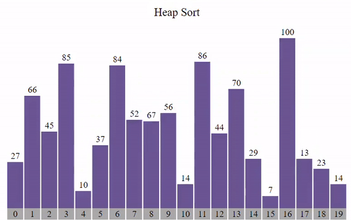

# Proposta do Trabalho

Um exemplo clássico de problema que pode ser solucionado utilizando-se hash e heap é o chamado top k itens. Neste problema, é preciso encontrar os k itens mais valiosos de uma coleção de dados. Logo, utiliza-se o hash para contar a frequência de todos os itens, enquanto o heap se aplica na manutenção de uma lista dos k itens de maior valor

• Crie uma tabela de dispersão (hash) para contar a frequência de cada elemento tokenizado da coleção de dados de entrada.

• Crie uma árvore de prioridades (heap) de tamanho k e insira os primeiros k elementos do
hash nela.

	1. Para cada elemento restante na hash, compare a contagem com o menor valor do heap.
	2. Se a contagem for maior do que o menor valor da heap, remova o menor valor, insira o novo elemento e refaça a estrutura.
	3. Caso contrário, ignore o elemento e vá para o próximo.
 
• No final, a heap conterá os k elementos com maiores valores (frequências) da coleção
de dados. Então, imprima-os em ordem crescente.


# O Algoritmo

```unordered_map```

A estrutura de dados unordered_map é uma implementação da tabela de hash em C++. Ela permite armazenar pares de chave-valor, onde a chave é única e usada para acessar o valor associado de maneira eficiente. É uma implementação rápida para busca, inserção e remoção de elementos com base na chave.

```Classe Frequencia```

A classe Frequencia é projetada para calcular a frequência das palavras em um texto. Ela possui uma variável membro privada chamada freq, que é um unordered_map. Isso permite que a classe mantenha um registro da contagem de cada palavra.

```Método inserirPalavra```

O método inserirPalavra da classe Frequencia é responsável por inserir uma palavra no unordered_map ou atualizar sua contagem caso a palavra já exista na estrutura. Isso é feito usando a função find do unordered_map para verificar se a palavra já está presente. Se estiver, a contagem é incrementada; caso contrário, a palavra é inserida com contagem 1.

```Método printFrequencia```

O método printFrequencia percorre o unordered_map e imprime cada par de chave-valor, onde a chave é a palavra e o valor é a frequência dessa palavra no texto.

# Métodos de Ordenação
```HeapSort + Hash Table```


O heapsort utiliza uma estrutura de dados chamada heap binário para ordenar os elementos a medida que os insere na estrutura. Assim, ao final das inserções, os elementos podem ser sucessivamente removidos da raiz da heap, na ordem desejada. Um heap binário é uma árvore binária mantida na forma de um vetor.

<p align="center">

</p>
<p align="center">
<em>Imagem 1: Representação do HeapSort. </em>

</p>

# Conclusão 

O projeto abordou a resolução de um problema clássico utilizando estruturas de dados e algoritmos, destacando a importância da eficiência na manipulação e análise de dados. A tarefa era encontrar os k itens mais frequentes em um conjunto de dados textual, envolvendo o uso de uma tabela de dispersão (unordered_map) para contar a frequência das palavras e uma árvore de prioridades (priority_queue) para manter os k itens mais relevantes.

A escolha das estruturas de dados foi fundamental para atingir a eficiência esperada. A tabela de dispersão (unordered_map) permitiu contar as frequências das palavras de forma eficaz, enquanto a árvore de prioridades (priority_queue) garantiu a seleção dos k itens mais valiosos, mantendo a complexidade de O(nlogk).

# Compilação e Execução 🔄

O algoritmo disponibilizado possui um arquivo Makefile que realiza todo o procedimento de compilação e execução. Para tanto, temos as seguintes diretrizes de execução:

| Comando                |  Função                                                                                               |                     
| -----------------------| ------------------------------------------------------------------------------------------------------|
|  `make clean`          | Apaga a última compilação realizada contida na pasta build                                            |
|  `make`                | Executa a compilação do programa utilizando o gcc, e o resultado vai para a pasta build               |
|  `make run`            | Executa o programa da pasta build após a realização da compilação                                     |
	
